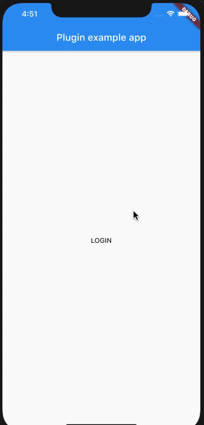

# deezer_sdk

A Flutter plugin that allows you to use the Deezer SDK with Flutter. Currently, only supports authentication operation.



## Usage

First, you need to go to [Deezer Developers](https://developers.deezer.com/) website need to register an application  (Android and iOS), in order to get an applicationId to use in the plugin. You also have to download the Android and iOS sdk.

## Android integration

First, you need to follow the install [instructions](https://developers.deezer.com/sdk/android#android_studio) in Deezer Developers in order to install
the android SDK in your application.

You also need to add this line in your AndroidManifest.xml in order to enable this library
that Deezer SDK needs to use in Android.

```xml
<manifest xmlns:android="http://schemas.android.com/apk/res/android"
    package="br.com.musicplayce.deezer_sdk_example">
    ...
    <!-- add this permissions -->
    <uses-permission android:name="android.permission.INTERNET" />
    <uses-permission android:name="android.permission.ACCESS_NETWORK_STATE" />
    <uses-permission android:name="android.permission.WAKE_LOCK" />
    
    <application
        android:name="io.flutter.app.FlutterApplication"
        android:label="deezer_sdk_example"
        android:icon="@mipmap/ic_launcher">
        ...
        <!-- and add this in order to enable this lib, that the deezer sdk uses -->
        <uses-library android:name="org.apache.http.legacy" android:required="false"/>
    </application>
</manifest>
```

## iOS integration

First, you need to follow the install [instructions](https://developers.deezer.com/sdk/ios#_quick_start) in Deezer Developers in order to install
the android SDK in your application. 

After install de SDK, you will need to disable the use_frameworks! clause in your Podfile if is enabled. You also need to manually run pod install
inside your ios/ folder, in order to install all the dependencies correctly.

```ruby
target 'Runner' do
  ....
  #use_frameworks! comment this 

  ....
  end
```

## Full Example

```dart
import 'package:deezer_sdk/models/auth_credentials.dart';
import 'package:flutter/material.dart';
import 'dart:async';

import 'package:flutter/services.dart';
import 'package:deezer_sdk/deezer_sdk.dart';

void main() {
  runApp(MyApp());
}

class MyApp extends StatefulWidget {
  @override
  _MyAppState createState() => _MyAppState();
}

class _MyAppState extends State<MyApp> {
  User _user;
  AuthCredentials _credentials;

  @override
  Widget build(BuildContext context) {
    return MaterialApp(
      home: Scaffold(
        appBar: AppBar(
          title: const Text('Plugin example app'),
        ),
        body: _user == null ? Center(
          child: FlatButton(
            child: Text("LOGIN"),
            onPressed: () {
              DeezerSdk.initialize(appId: "421042");
              print("state ${DeezerSdk.authState}");
              DeezerSdk.login(
                  onComplete: (c, u) async{
                    final s = await DeezerSdk.authState;
                    print("teste $s");
                    setState(() {
                      _credentials = c;
                      _user = u;
                    });
                  },
                  onError: (error) => print("error $error"),
                  onCancel: () => print("Cancelled")
              );
            },
          ),
        ) : Padding(
          padding: const EdgeInsets.symmetric(
            horizontal: 10
          ),
          child: Column(
            mainAxisAlignment: MainAxisAlignment.center,
            crossAxisAlignment: CrossAxisAlignment.center,
            children: <Widget>[
              Image.network(
                _user.pictureBig,
                width: 100,
                height: 100,
              ),
              const SizedBox(height: 5,),
              Text(_user.name),
              const SizedBox(height: 5,),
              Text(
                "Token: ${_credentials.accessToken}",
                textAlign: TextAlign.center
              )
            ],
          ),
        )
      ),
    );
  }
}
```

## Known Issues

Sometimes the DeezerSDK folder on iOS maybe will bug. If this occur, remove him and add him again.